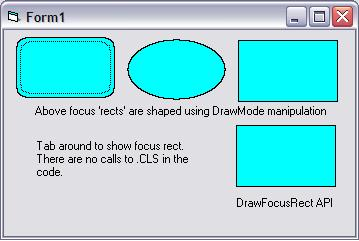



## FYI: Shaped Focus 'Rect'

### Description

Ability to use shapes for a focus "rectangle". The DrawFocusRect API only draws rectangles, but what if you want some other shape? Well, this example can show you how. Also included is an example on how to dictate the color of the rectangle drawn by DrawFocusRect API and also how to draw a custom focus rect in the XOR fashion. BTW I don't really like the quality of the shaped focus. Drawing every other pixel on a shape looks pretty poor in my opinion. Thought I could use this but, oh well. I offer it to you should you care to use it, modify it, or find a way to make it better. For shaped regions, maybe a blended/soft solid shape would serve better and certainly would look better. One thing I did learn, was how to create an XOR-like brush and use it to paint something &amp; then remove the painted something; so not all is lost :)
 
### More Info
 

             |
---                |---
**Submitted On**   |2007-08-14 17:20:02
**By**             |[LaVolpe](https://github.com/Planet-Source-Code/PSCIndex/blob/master/ByAuthor/lavolpe.md)
**Level**          |Intermediate
**User Rating**    |4.7 (14 globes from 3 users)
**Compatibility**  |VB 5\.0, VB 6\.0
**Category**       |[Graphics](https://github.com/Planet-Source-Code/PSCIndex/blob/master/ByCategory/graphics__1-46.md)
**World**          |[Visual Basic](https://github.com/Planet-Source-Code/PSCIndex/blob/master/ByWorld/visual-basic.md)
**Archive File**   |[FYI\_\_Shape2079548142007\.zip](https://github.com/Planet-Source-Code/lavolpe-fyi-shaped-focus-rect__1-69152/archive/master.zip)

